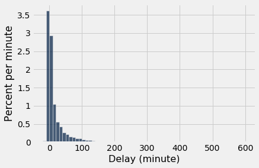
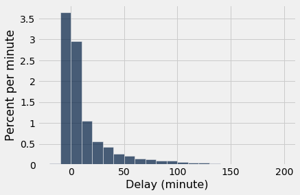
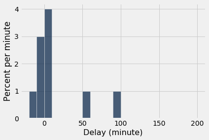
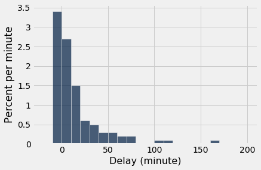
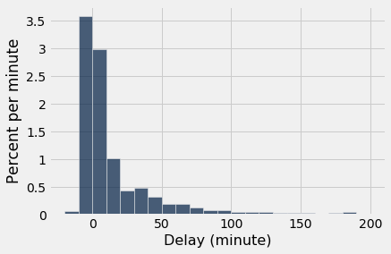

---
redirect_from:
  - "/chapters/10/2/sampling-from-a-population"
interact_link: content/chapters/10/2/Sampling_from_a_Population.ipynb
kernel_name: python3
has_widgets: false
title: 'Sampling from a Population'
prev_page:
  url: /chapters/10/1/Empirical_Distributions.html
  title: 'Empirical Distributions'
next_page:
  url: /chapters/10/3/Empirical_Distribution_of_a_Statistic.html
  title: 'Empirical Distibution of a Statistic'
comment: "***PROGRAMMATICALLY GENERATED, DO NOT EDIT. SEE ORIGINAL FILES IN /content***"
---
{:.input_area}
```python
# HIDDEN

from datascience import *
path_data = '../../../data/'
import matplotlib
matplotlib.use('Agg', warn=False)
%matplotlib inline
import matplotlib.pyplot as plots
plots.style.use('fivethirtyeight')
import numpy as np
```


### Sampling from a Population

The law of averages also holds when the random sample is drawn from individuals in a large population.

As an example, we will study a population of flight delay times. The table `united` contains data for United Airlines domestic flights departing from San Francisco in the summer of 2015. The data are made publicly available by the [Bureau of Transportation Statistics](http://www.transtats.bts.gov/Fields.asp?Table_ID=293) in the United States Department of Transportation.

There are 13,825 rows, each corresponding to a flight. The columns are the date of the flight, the flight number, the destination airport code, and the departure delay time in minutes. Some delay times are negative; those flights left early.


{:.input_area}
```python
united = Table.read_table(path_data + 'united_summer2015.csv')
united
```


<div markdown="0" class="output output_html">
<table border="1" class="dataframe">
    <thead>
        <tr>
            <th>Date</th> <th>Flight Number</th> <th>Destination</th> <th>Delay</th>
        </tr>
    </thead>
    <tbody>
        <tr>
            <td>6/1/15</td> <td>73           </td> <td>HNL        </td> <td>257  </td>
        </tr>
        <tr>
            <td>6/1/15</td> <td>217          </td> <td>EWR        </td> <td>28   </td>
        </tr>
        <tr>
            <td>6/1/15</td> <td>237          </td> <td>STL        </td> <td>-3   </td>
        </tr>
        <tr>
            <td>6/1/15</td> <td>250          </td> <td>SAN        </td> <td>0    </td>
        </tr>
        <tr>
            <td>6/1/15</td> <td>267          </td> <td>PHL        </td> <td>64   </td>
        </tr>
        <tr>
            <td>6/1/15</td> <td>273          </td> <td>SEA        </td> <td>-6   </td>
        </tr>
        <tr>
            <td>6/1/15</td> <td>278          </td> <td>SEA        </td> <td>-8   </td>
        </tr>
        <tr>
            <td>6/1/15</td> <td>292          </td> <td>EWR        </td> <td>12   </td>
        </tr>
        <tr>
            <td>6/1/15</td> <td>300          </td> <td>HNL        </td> <td>20   </td>
        </tr>
        <tr>
            <td>6/1/15</td> <td>317          </td> <td>IND        </td> <td>-10  </td>
        </tr>
    </tbody>
</table>
<p>... (13815 rows omitted)</p>
</div>


One flight departed 16 minutes early, and one was 580 minutes late. The other delay times were almost all between -10 minutes and 200 minutes, as the histogram below shows.


{:.input_area}
```python
united.column('Delay').min()
```


{:.output .output_data_text}
```
-16
```


{:.input_area}
```python
united.column('Delay').max()
```


{:.output .output_data_text}
```
580
```


{:.input_area}
```python
delay_bins = np.append(np.arange(-20, 301, 10), 600)
united.hist('Delay', bins = delay_bins, unit = 'minute')
```


{:.output .output_png}



For the purposes of this section, it is enough to zoom in on the bulk of the data and ignore the 0.8% of flights that had delays of more than 200 minutes. This restriction is just for visual convenience; the table still retains all the data.


{:.input_area}
```python
united.where('Delay', are.above(200)).num_rows/united.num_rows
```


{:.output .output_data_text}
```
0.008390596745027125
```


{:.input_area}
```python
delay_bins = np.arange(-20, 201, 10)
united.hist('Delay', bins = delay_bins, unit = 'minute')
```


{:.output .output_png}



The height of the [0, 10) bar is just under 3% per minute, which means that just under 30% of the flights had delays between 0 and 10 minutes. That is confirmed by counting rows: 


{:.input_area}
```python
united.where('Delay', are.between(0, 10)).num_rows/united.num_rows
```


{:.output .output_data_text}
```
0.2935985533453888
```


### Empirical Distribution of the Sample

Let us now think of the 13,825 flights as a population, and draw random samples from it with replacement. It is helpful to package our code into a function. The function `empirical_hist_delay` takes the sample size as its argument and draws an empiricial histogram of the results.


{:.input_area}
```python
def empirical_hist_delay(n):
    united.sample(n).hist('Delay', bins = delay_bins, unit = 'minute')
```


As we saw with the dice, as the sample size increases, the empirical histogram of the sample more closely resembles the histogram of the population. Compare these histograms to the population histogram above.


{:.input_area}
```python
empirical_hist_delay(10)
```


{:.output .output_png}



{:.input_area}
```python
empirical_hist_delay(100)
```


{:.output .output_png}



The most consistently visible discrepancies are among the values that are rare in the population. In our example, those values are in the the right hand tail of the distribution. But as the sample size increases, even those values begin to appear in the sample in roughly the correct proportions.


{:.input_area}
```python
empirical_hist_delay(1000)
```


{:.output .output_png}



### Convergence of the Empirical Histogram of the Sample
What we have observed in this section can be summarized as follows:

For a large random sample, the empirical histogram of the sample resembles the histogram of the population, with high probability.

This justifies the use of large random samples in statistical inference. The idea is that since a large random sample is likely to resemble the population from which it is drawn, quantities computed from the values in the sample are likely to be close to the corresponding quantities in the population.
